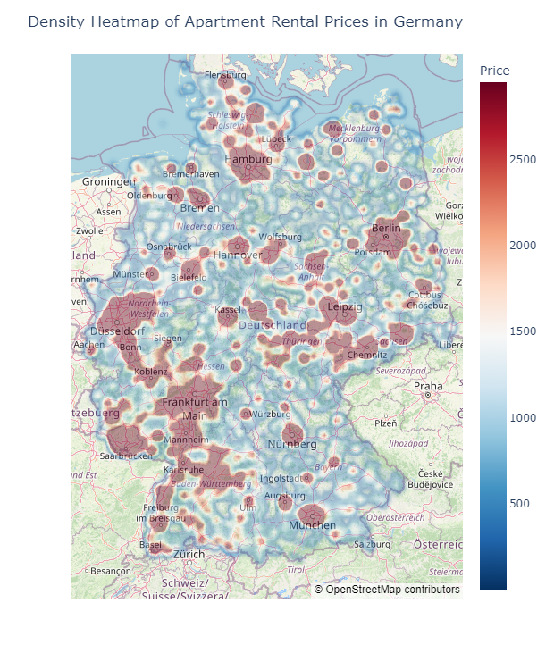
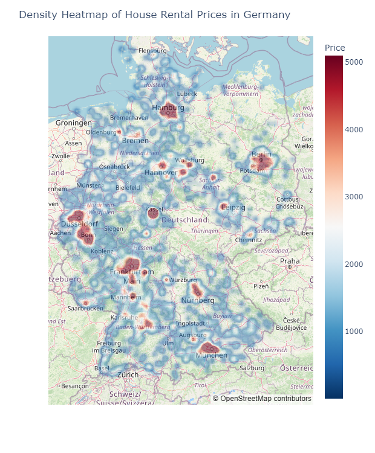

# Computational Social Science Project: Analysis & Automated Valuation of German Real Estate
## The Project
This work is a project for a Computational Social Science lecture at the LMU. The Professor in charge of the course is [Christoph Kern (LMU)](https://www.stat.lmu.de/soda/en/team/contact-page/christoph-kern-11bd67d0.html).

### Introduction
Real estate plays a pivotal role in the German economy, experiencing dynamic growth and facilitated by the emergence of prominent online platforms for real estate advertising. This technological shift has mitigated information asymmetry, enhancing liquidity in both sales and rental markets.

### Objectives
- Investigate variations in apartment and house rental prices across different regions of Germany.
- Identify factors influencing rental pricing to better understand the German real estate market.
- Incorporate spatial data to understand the geographical patterns and spatial relationships influencing rental prices.
- Evaluate the efficacy of machine learning models in predicting rental prices based on internal and external features, including spatial data.
- Provide visualizations depicting rental prices across Germany to highlight regional disparities within the real estate market.

### Methodology
- Scraped data from German real estate websites such as 'immonet.de', 'kleinanzeigen.de', and 'engelvoelkers.de'.
- Utilized machine learning models, particularly tree-based bagging and boosting ensembling methods, to estimate rental prices.
- Employed visualization techniques using OpenStreetMaps to depict rental prices across Germany and analyze spatial patterns.

### Key Findings
- Areas in and around prominent cities such as Munich, Hamburg, Frankfurt, and Berlin exhibited the highest rental prices, indicating regional disparities within the real estate market.
- Interior size and zip code were identified as the two most important features for predicting apartment and house prices using the RandomForestRegressor model.
- The XGBoost model outperformed CatBoost and Random Forest Regressor, achieving an R-squared value of 0.855 for apartments and 0.591 for houses.

### Spatial Density Maps

  
  
Figure 1: Spatial density map showing rental price distribution of apartments.

  
  
Figure 2: Spatial density map showing rental price distribution of houses.

##

### Contributors
- Aaryan Mallayanmath
- Davit Martirosyan

We hope you find our analysis insightful and informative. If you have any questions or feedback, please don't hesitate to reach out.

Thank you for visiting!
